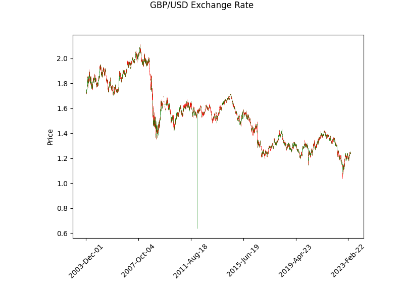
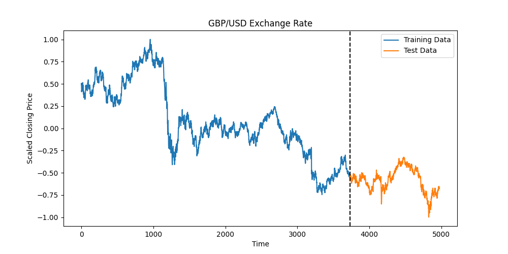
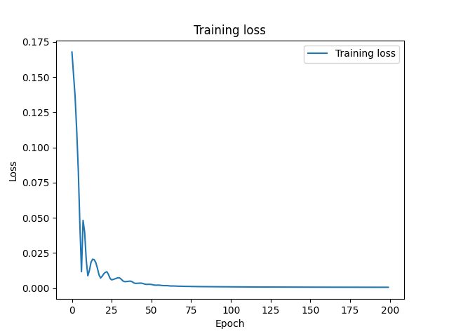
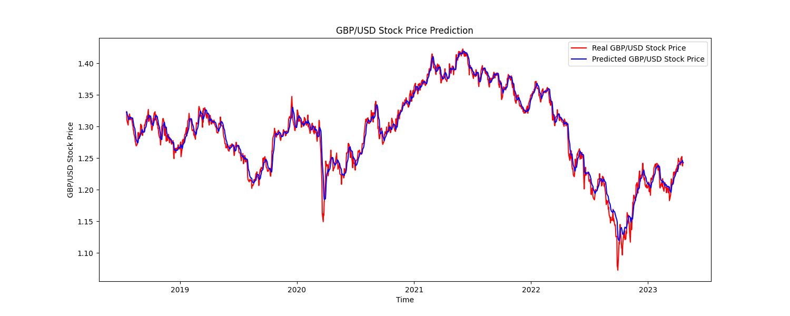

# Bidirectional LSTM with PyTorch to predict GBP/USD
This is a Python script that uses Bidirectional LSTM (BiLSTM) neural network to predict the GBP/USD exchange rate. The data is downloaded using the yfinance package and pre-processed before being passed through the model. The model is built using PyTorch framework, and the results are visualized using the matplotlib and mplfinance libraries.

### Requirements
- Python 3.6 or above
- PyTorch
- NumPy
- Pandas
- Matplotlib
- mplfinance
- Scikit-learn
- yfinance

### Dataset

The Dataset was downloaded into a dataframe using yfinance API. The dataset contains data of the open, close, high, low, adj close prices and volume traded per day since 01/01/1990 till the present date.

After preprocessing the data it is split into the train and test datasets.

### Model
The Bidirectional LSTM model has an input dimension of 1, hidden dimension of 32, two layers, and an output dimension of 1. The model is trained for 200 epochs with a learning rate of 0.01 using the mean squared error loss function and the Adam optimizer as per usual.
 

The calculated RMSE values are quite good:
- Train Score: 0.01219
- Test Score: 0.01111

The predicted values vs the test dataset look great!

### Usage
To run the script, simply execute python `bidirect_lstm_gbpusd.py`.

The script will download historical data of GBP/USD exchange rate from Yahoo Finance, preprocess the data, and train a Bidirectional LSTM neural network using PyTorch. Finally, the script will visualize the predicted and actual values of the exchange rate.

The hyperparameters of the model, such as the number of epochs and the number of layers, can be adjusted by modifying the values in the script.

Acknowledgments
This script was inspired by the following articles:

https://towardsdatascience.com/stock-prediction-in-python-b66555171a2